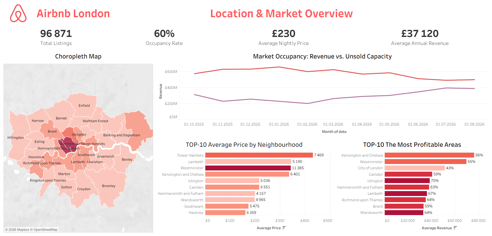
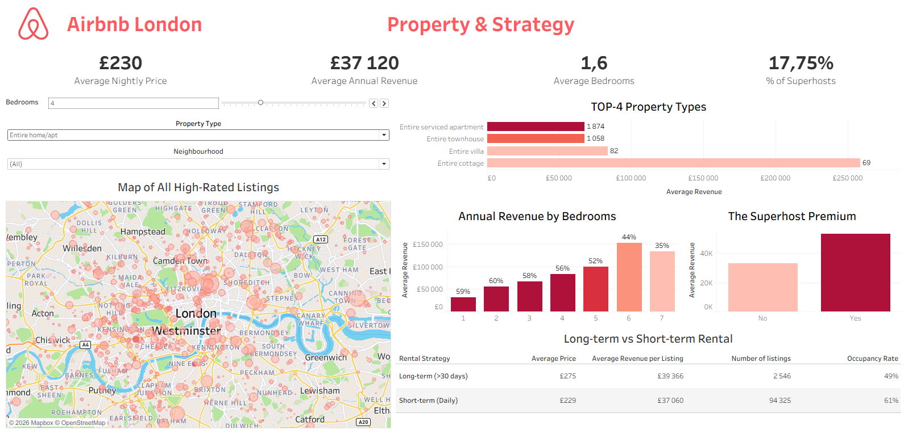

# [Airbnb London: Real Estate Investment & Market Analysis](https://public.tableau.com/views/AirbnbLondonAnalysis/AirbnbLondonAnalysis?:language=en-US&:sid=&:redirect=auth&:display_count=n&:origin=viz_share_link)

## Project Overview
This project serves as a strategic decision-making tool for real estate investors entering the highly competitive London short-term rental market. The objective is to analyze historical data to determine the most profitable locations, optimal property configurations, and the most effective rental strategies (long-term vs. short-term).

The analysis is presented through a comprehensive, interactive two-page Tableau dashboard.

## Data Engineering & Tech Stack
* **Tools:** MySQL, Tableau Desktop
* **Data Cleaning & Transformation:** Addressed major CSV formatting issues (column shifts due to delimiters) and exported clean data using reliable TSV formats.
* **Optimized Backfilling (35M+ Rows):** The raw `calendar` table lacked price data for specific dates. Instead of using a resource-heavy `UPDATE JOIN` that would crash on 35 million rows, I optimized the ETL process by completely dropping and recreating the table. I used `COALESCE` to backfill missing daily prices with the base listing price, drastically improving query performance.

## Dashboard 1: Location & Market Overview Analysis

* **Choropleth Map & Top 10 Profitable Areas:** The data clearly highlights a "Golden Triangle" in London. Kensington and Chelsea, Westminster, and the City of London are the undisputed leaders in profitability, generating up to £70k+ annually. Conversely, outer boroughs like Tower Hamlets have a massive supply of listings but fail to reach the top 10 in profitability.
* **Top 10 Average Price by Neighbourhood:** Reinforces the geographic divide, showing that central, premium boroughs command significantly higher nightly rates, driving overall revenue.
* **Market Occupancy (Revenue vs. Unsold Capacity):** The supply in London vastly exceeds demand. The large gap between unsold capacity (orange) and actual revenue (purple) indicates fierce competition for tourists. The market also exhibits strict seasonality, with significant dips in January-February and peaks in mid-summer.

  

## Dashboard 2: Property & Strategy Analysis

* **Top Property Types:** "Entire serviced apartments" and "Entire townhouses" dominate the market in terms of revenue generation, vastly outperforming standard private rooms or shared spaces.
* **Annual Revenue by Bedrooms:** Revenue scales predictably with the number of bedrooms. While 1-2 bedroom apartments are the most common, the "sweet spot" for maximum ROI is a 5-bedroom property. It maintains the highest occupancy rate while generating peak revenue (~£100k). Properties with 6-7 bedrooms show higher potential revenue but carry a higher risk of vacancy.
* **Long-term vs. Short-term Rental:** Counterintuitively, long-term rentals (>30 days) are more lucrative. They generate higher average annual revenue (£39.3k vs £37k) and command a higher nightly price (£275 vs £229), despite a lower overall occupancy rate (49% vs 61%).
* **The Superhost Premium:** There is a massive financial incentive for operational excellence. Listings managed by Superhosts generate significantly higher annual revenue, proving that high-quality service and top ratings directly impact profitability.

    

## Final Investment Recommendation
Based on the data, the optimal strategy for a new investor in London is **not** to buy a small apartment for daily tourist rentals. The market is oversaturated, highly seasonal, and highly competitive. 

**The Winning Strategy:**
Invest in a large property (**Entire Townhouse, 4-5 bedrooms**) located within the **"Golden Triangle"** (Kensington, Westminster, or City of London) and target the **Long-term rental market (>30 days)**. This approach yields the highest average annual revenue, minimizes the operational overhead of daily turnovers, mitigates the risks of winter seasonality, and bypasses the fierce competition for short-term tourists. Additionally, achieving and maintaining **Superhost status** is critical to maximizing the property's earning potential.