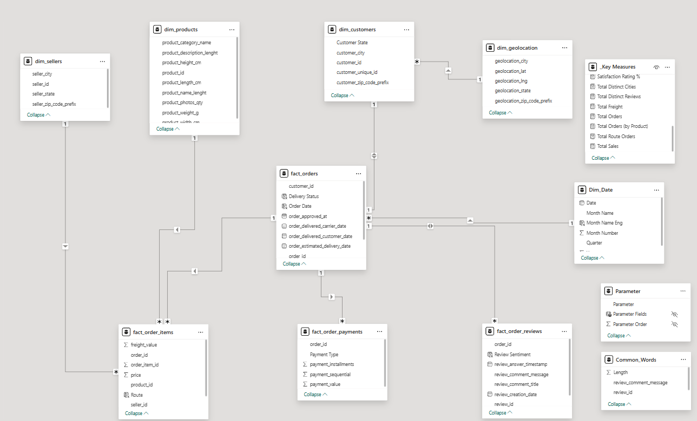
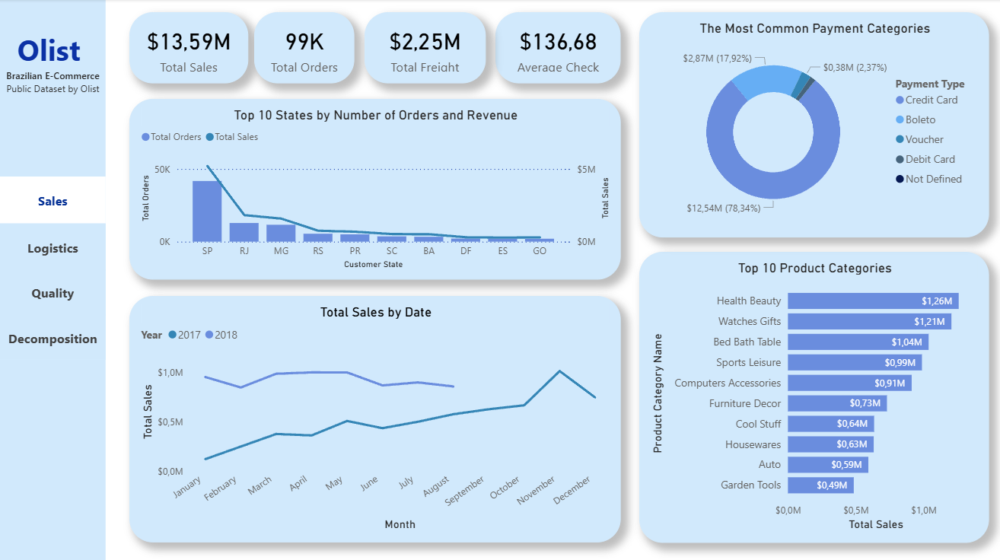
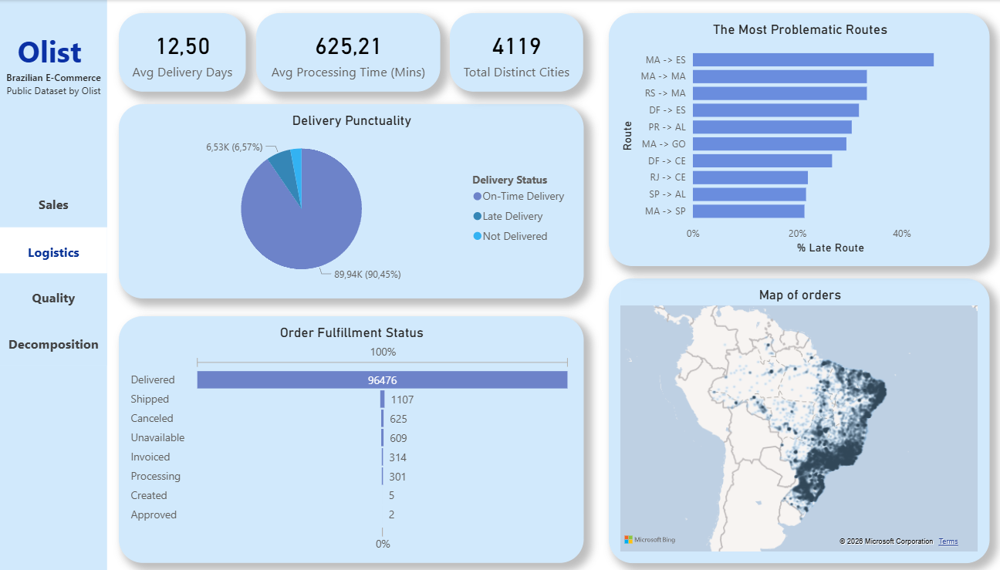
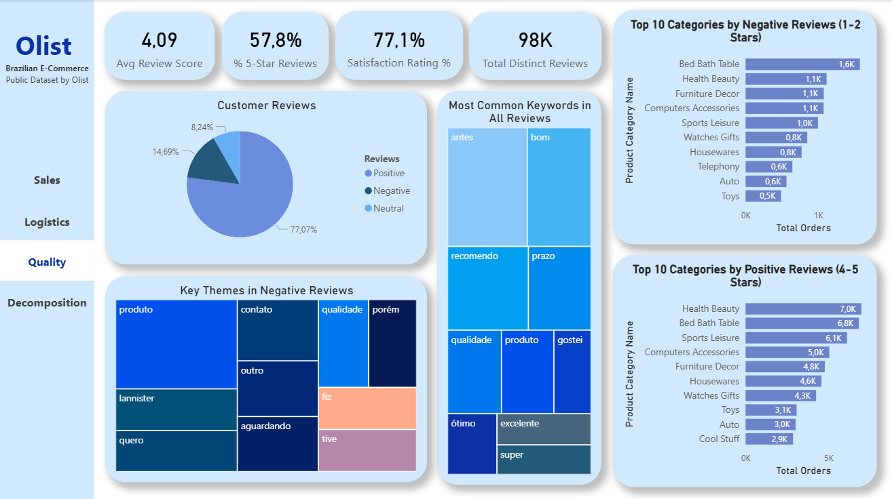
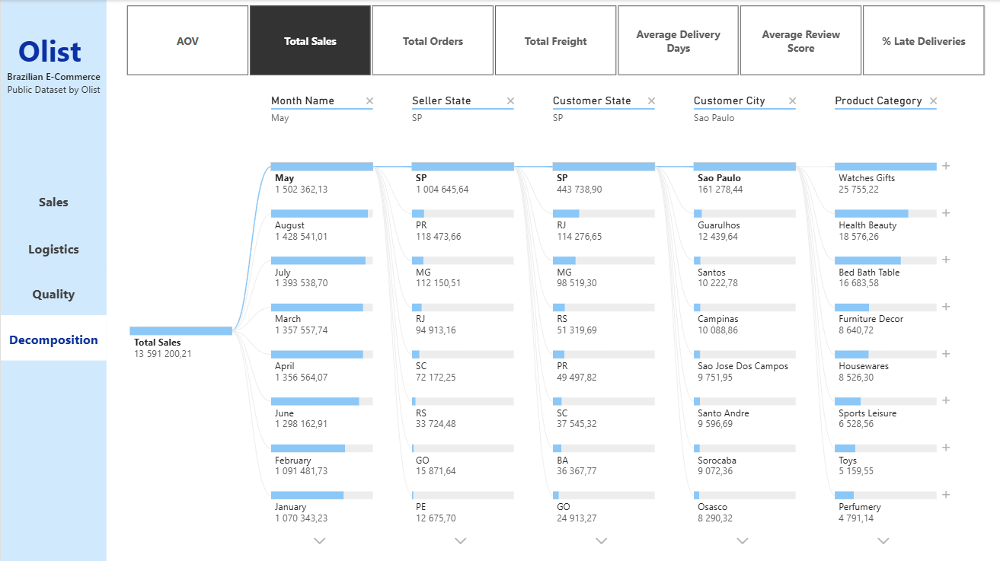

**E-Commerce Performance & Logistics Analysis (Olist Dataset)**

**Project Overview**

This project presents a comprehensive data analysis of the Brazilian e-commerce marketplace, Olist. The main goal is to investigate key business performance indicators (GMV, AOV), identify logistics bottlenecks, and analyze customer satisfaction using text analysis of reviews.

The dashboard was developed in Power BI and consists of four interactive pages connected by a seamless navigation panel: Sales, Logistics, Quality, and Decomposition.

**Tools & Technologies**
- **Tool**: Power BI Desktop

- **Data Modeling**: Built a Star Schema (1-to-many relationships, configured BI-directional cross-filtering).

    

- **Data Transformation (Power Query)**: Data cleaning, text tokenization for review analysis, utilization of Left Anti-Join for filtering Portuguese stop-words.

- **Metrics (DAX)**: Created complex measures (calculating % of late deliveries by route using Filter Context, time intelligence, segmentation).

- **Interactivity**: Field Parameters (dynamic metric switching), Bookmarks & Page Navigation, AI-driven Decomposition Tree.

**Key Insights**
1. Sales Performance
- Total Sales amount to \$13.59M, with an Average Order Value (AOV) of $136.68.

- The lion's share of sales and orders (over 40k) comes from the state of São Paulo (SP).

- The most profitable product categories are "Health Beauty" (\$1.26M) and "Watches Gifts" ($1.21M).

- Credit cards are the absolute preferred payment method (78.34% of all transactions).

    

2. Logistics & Delivery
- Overall, logistics perform well: 90.45% of orders are delivered on time. The national average delivery time is 12.5 days.

- However, critical issues were identified on specific routes. For example, the MA -> ES route has a catastrophic delay rate of over 46%.

- Analysis revealed that delays frequently occur on interregional routes with a low volume of orders, suggesting a need to review contracts with local carriers.

    

3. Quality & Customer Experience
- The overall satisfaction rating is 77.1% (5-4 scores) with an average score of 4.09.

- **Text Mining Insight**: By parsing review text and filtering out stop-words, it was discovered that low ratings (1-2 stars) are predominantly not related to the product quality itself. The most common keywords in negative reviews are: "aguardando" (waiting), "contato" (contact), and "quero" (want [a refund]). This strongly indicates issues with communication and customer support during delivery delays.

- **Easter Egg**: An abnormally frequent use of the word "lannister" was found in the dataset, which is a result of Olist anonymizing customer data (using names from "Game of Thrones").

    

4. Root Cause Analysis (Decomposition Tree)
- Developed a dynamic page based on the Decomposition Tree visual. Users can select a specific metric (AOV, Total Sales, Avg Delivery Days, etc.) with a single click and leverage built-in AI to expand the tree, instantly finding the states, cities, or product categories that impact the result the most.

    